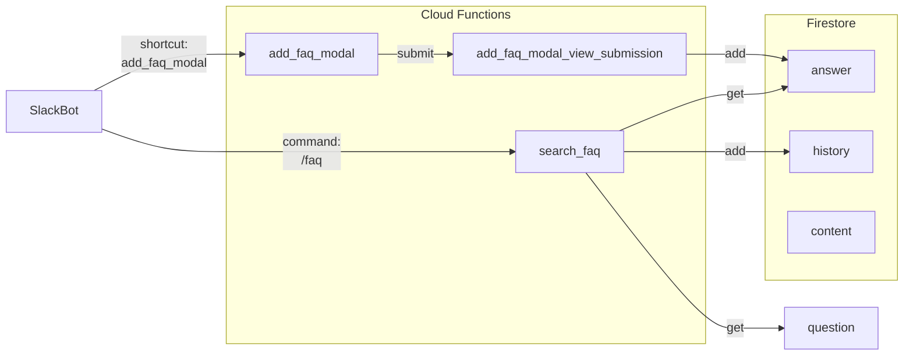

# faq-holer

FAQとして質問文と回答文の凡例を登録しておき、質問に近いFAQを返すSlackボットです

## アーキテクチャ
- Cloud Functions
  - Python 3.9
- Firestore

## 処理フロー


## デプロイ
### gcloud CLI
```bash
cd ./src
gcloud functions deploy faq_add \
--runtime python39 \
--trigger-http \
--region asia-northeast2 \
--security-level secure-always \
--env-vars-file .env.yaml \
--allow-unauthenticated
```