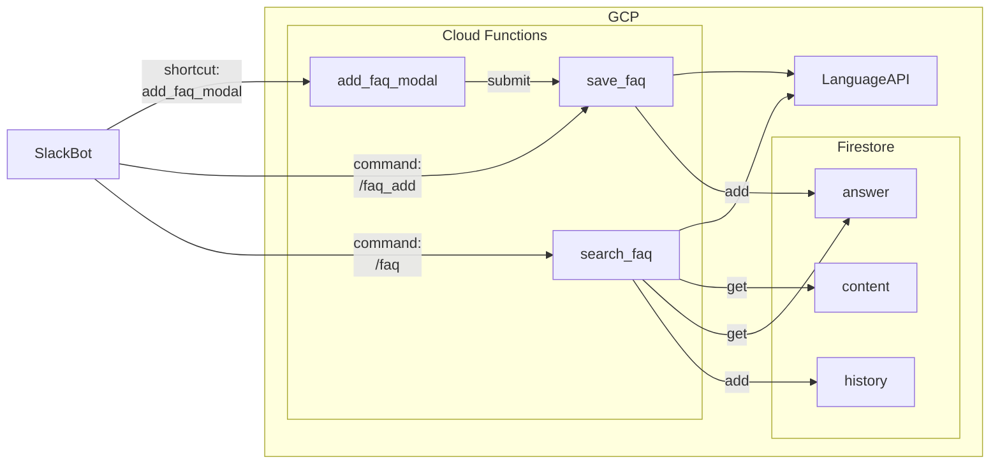

# faq-holer

FAQとして質問文と回答文の凡例を登録しておき、質問に近いFAQを返すSlackボットです

## アーキテクチャ
- Cloud Functions
  - Python 3.9
- Firestore
- Cloud Natural Language API

## 処理フロー


## デプロイ
### gcloud CLI
```bash
cd ./src
gcloud functions deploy faq_add \
--runtime python39 \
--trigger-http \
--region asia-northeast2 \
--security-level secure-always \
--env-vars-file .env.yaml \
--allow-unauthenticated
```

## memo
### PythonをCloud Functionsにデプロイする
https://cloud.google.com/sdk/gcloud/reference/functions/deploy
> For Python, this is main.py.

メインメソッドのあるファイルはmain.pyにする必要あり

### gcloud CLIで任意Pythonを指定
CLOUDSDK_PYTHONを環境変数に設定する
- 参考 https://zenn.dev/ytkhs/articles/85792f0f14474f
- Windowsの場合はpython.exeファイルを指定する必要があり

### Firestore用サービスアカウント作成＆認証ファイル作成
https://cloud.google.com/docs/authentication/production?authuser=2#create-service-account-gcloud

Roleは`roles/datastore.user`を付与する